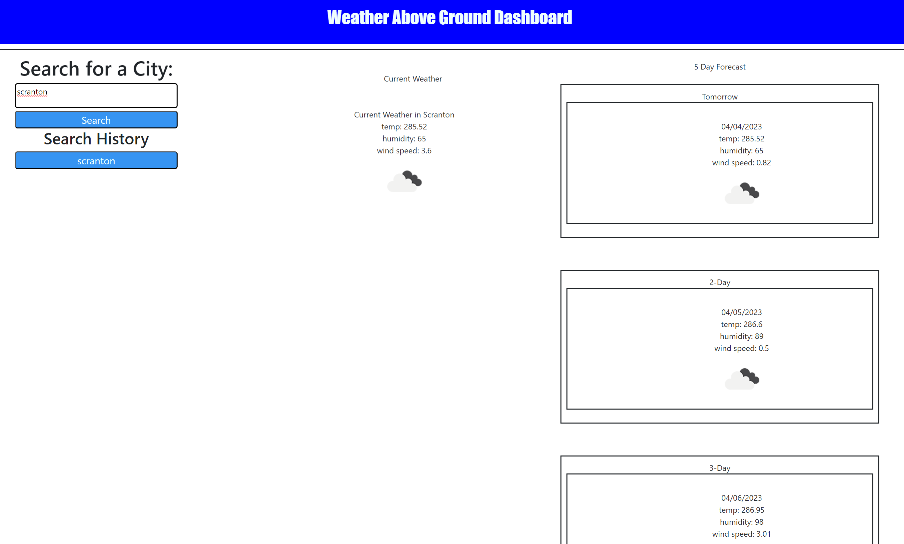

# Weather Above Ground
Making a weather page to look up the current weather and a 5 day forecast by searching a city of interest. 

## Users Story
As a coding student I want to make a weather website with the following user story and criteria:

### User Story

AS A traveler
I WANT to see the weather outlook for multiple cities
SO THAT I can plan a trip accordingly

### Acceptance Criteria

* GIVEN a weather dashboard with form inputs
* WHEN I search for a city
* THEN I am presented with current and future conditions for that city and that city is added to the search history
* WHEN I view current weather conditions for that city
* THEN I am presented with the city name, the date, an icon representation of weather conditions, the temperature, the humidity, and the wind speed
* WHEN I view future weather conditions for that city
* THEN I am presented with a 5-day forecast that displays the date, an icon representation of weather conditions, the temperature, the wind speed, and the humidity
* WHEN I click on a city in the search history
* THEN I am again presented with current and future conditions for that city

## Installation

N/A

## Usage

This site will be used to display my work.

## Credits

Lukas Durkin

## License
Please refer to license in the repo

## URL
https://dukelurkin.github.io/WeatherAboveGround

## Image
